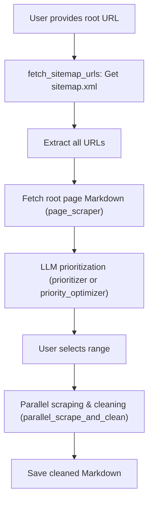

# Agentic Web Scraper (Redesign Branch)

## 概要・リポジトリの位置づけ

本リポジトリは、LLM/Agent指向のWebスクレイピング技術の実験・評価を目的としたプロトタイプ/リファレンス実装です。
従来の「静的Python＋バッチ処理」から脱却し、**fast-agent**フレームワークの「宣言的エージェント設計」「ワークフローパターン（Parallel/Evaluator-Optimizer等）」を最大限活用した、次世代的なWebクローラの設計・検証を行います。

- **現状**: mainブランチや従来実装は場当たり的なバッチ処理・AI利用が混在していたため、本ブランチ（redesign/agentic-architecture）では設計思想を抜本的に見直し、責任分界を明確化。
- **目的**: 「AI/LLMに任せるべき部分」と「静的Pythonで担うべき部分」を明確に分離し、fast-agentの強み（デコラティブなエージェント宣言・ワークフロー構築）を活かした構成を追求します。

---

## Iterative Development Roadmap

このブランチでは、以下のイテレーションで段階的にfast-agentの高度な機能を評価・実装します。

### Iteration 1: Parallelによる高速スクレイピングの評価
- fast-agentの `@fast.parallel` を活用し、複数URLのスクレイピング（Fetch MCP＋ノイズ除去等）を並列化。
- Python側でasyncioやforループを書くことなく、宣言的に高速なページ取得・処理を実現できるかを検証します。
- 並列度・エラー時の挙動・進捗管理・集約処理の使い勝手等を重点評価。
- **優先度付け（prioritizer）については、pydantic-aiを部分的に導入して型保証付きのAIレスポンスを得る方式も検証中。**
    - fast-agentのエージェントとしてではなく、pydantic-aiエージェントを呼び出して「型通りのデータが返るまで自動リトライ」など堅牢性を高める設計も可能。
    - 必要に応じて、MCP Server側でpydantic-aiを活用したツール実装を行い、クライアントから共通利用する方式も検討。

### Iteration 2: Evaluator-Optimizerによる優先度付け・品質最適化
- fast-agentの `@fast.evaluator_optimizer` を活用し、LLMによる「優先度付け→評価→必要なら改善」ループを自動化。
- rootページ＋URLリストから、より品質・説明性の高い優先順位リストを生成し、ユーザーが納得感を持って範囲選択できる体験を目指します。
- 生成物の品質・ループ回数・ユーザビリティ等を評価。

---

## 現状のアーキテクチャ（抜粋）



- 静的Python：I/O・CLI・進捗/状態管理
- fast-agent：ページ取得・優先度付け・並列クロール・品質最適化など知的/AIパート

---

## fast-agent活用方針

- **Parallel**: ページスクレイピングやノイズ除去など、I/O負荷が高い処理を複数エージェントで並列実行。高速化・スケーラビリティ・堅牢性を重視。
- **Evaluator-Optimizer**: LLMの多段階評価・最適化ループで、単なる一発プロンプトよりも品質・説明性の高い優先度付け/分類を実現。
- **Chain/その他**: 必要に応じてChain/Router/Orchestrator等のパターンも柔軟に適用。

---

## Usage (再掲)
1. Clone the repository:
   ```bash
   git clone https://github.com/KunihiroS/Agentic-web-scraper.git
   cd Agentic-web-scraper
   ```
2. Install dependencies:
   ```bash
   uv pip install -r requirements.txt
   uvx playwright install chromium
   ```
3. Configure your MCP server and API keys as needed (see `fastagent.config.yaml`)
4. Run the crawler (specify the root URL as an argument or interactively):
   ```bash
   uv run agent.py https://fast-agent.ai/
   ```
5. The cleaned content will be saved to `site_crawl_result.md`

---

## 今後の展望
- 各イテレーションの成果・課題・ノウハウを随時READMEに反映し、fast-agent活用のリファレンスとしても機能させます。
- ユーザー/開発者が「AI×Webクローラ設計」の最適解を模索できる土壌を目指します。

---

## License
MIT
